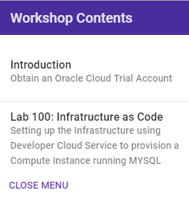

# MySQL Deployment using Infrastructure as Code

Welcome to the **Oracle Public Cloud** MySQL Deployment using Infrastructure as Code workshop. This workshop will walk you through the process of creating an infrastructure to support deployment of a MYSQL in the Oracle Cloud using Developer Cloud Service. Then, you will deploy a couple of microservices (AlphaOffice application) to Oracle Application Container Cloud Service that uses that MYSQL database.

To learn more about this workshop please watch the video below.  

<a href="https://www.youtube.com/watch?v=ivNEREBsH9k&t=0s&index=3&list=PLPIzp-E1msrYGLKIgW3njO3uUkvXD0bAH" target="_video">Workshop Overview link goes here</a>

**Step 1**: Acquire an Oracle Cloud Trial Account

- Bookmark this page for future reference.

- Please click on the URL to create your <a href="https://myservices.us.oraclecloud.com/mycloud/signup?language=en&sourceType=:ex:tb:::RC_PDMK180212P00140:Docker_HOL&SC=:ex:tb:::RC_PDMK180212P00140:Docker_HOL&pcode=PDMK180212P00140" target="_trial">Free Account</a> and complete all the required steps. When you complete the registration process you'll receive a $300 credit that will enable you to complete the lab for free.  Additionally, you'll have 1000s of hours left over to continue to explore the Oracle Cloud.

  - Soon after requesting your trial you will receive the following email.

  

### **Step 2**: Navigate to Lab 100

- _You can see a list of Lab Guides_ by clicking on the **Menu Icon** hamburger in the upper left corner of the browser window. Then, **Select Lab 100: Infrastructure as Code**.

  

  
