# MYSQL Deployment using Infrastructure as Code Workshop

 

## Workshop Overview

In this workshop we will use the toolset now built into Developer Cloud Service. We will assume that two persons will be used throughout the labs. Lab 100 will feature the Infrastructure persona (Chip) who is responible for laying down the footprint to support application deployments in the Oracle Cloud. Chip will lay the the ground work for a MYSQL DB running on a Oracle Linux Compute instance. He will build and deploy an environment by creating a "Custom Image" and then create an Oracle Linux VM using that image. This will be accomplished using the Developer Cloud Service's Packer and Terraform builtins. 

The second persona is that of a developer (Serena) who will build out the AlphaOffice application using Developer Cloud Service in Lab 200 and deploy it into an Oracle Application Cloud Service instance. The AlphaOffice application will query the MYQL DB running on the Compute instance. All of this will be driven through Developer Cloud Service.

In Lab 300 Serena will make a couple of changes in the AlphaOffice imported GitHub repository and watch it fire off a re-build and re-deployment of the AlphaOffice application.


- Packer and Terraform are both open source tools from Hashcorp that are integrated into Developer Cloud Service. They will be used in a Pipeline flow to create the Cloud infrastructure and build out the custom Linux based VM.
- [Packer Documentation](https://www.packer.io/intro/index.html)
- [Terraform Documentation](https://www.terraform.io/)

## Introduction
In this lab we will obtain an Oracle Cloud Trial Account, create ssh key pairs, login into your Trial, create a VCN (Virtual Compute Network) and Compartment, create a new compute instance and finally install docker into the instance.

***To log issues***, click here to go to the [github oracle](https://github.com/oracle/learning-library/issues/new) repository issue submission form.

## Objectives of this Workshop

- Login to your Oracle Trial Acoount
- Use Developer Cloud Service new features of Packer / Terraform / Pipelines / Software Templates
- Generate and Deploy a Custom Image into your Oracle Trial account
- Deploy two Node.js applications using Developer Cloud Service into Application Container Cloud Service
- Make a change in a DevCS repository which will fire off a CI/CD re-build / re-deploy 

# Create a Compartment and VCN

You will create some initial required infrastructure components within your Trail account.

## Login to Account

### **Step 1**: Verify your Oracle Cloud Trial Account

- You have already applied for and received your Oracle Cloud Trial Account


### **STEP 2**: Log in to your OCI dashboard

- Once you receive the **Get Started with Oracle Cloud** Email, make note of your **Username, Password and Cloud Account Name**.

  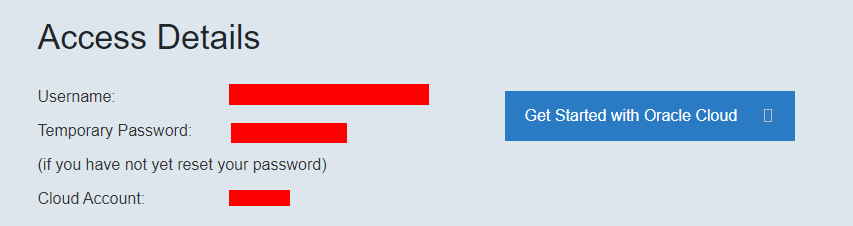

- From any browser go to. :

    [https://cloud.oracle.com/en_US/sign-in](https://cloud.oracle.com/en_US/sign-in)

- Enter your **Cloud Account Name** in the input field and click the **My Services** button. If you have a trial account, this can be found in your welcome email. Otherwise, this will be supplied by your workshop instructor.

  

- Enter your **Username** and **Password** in the input fields and click **Sign In**.

  

**NOTE**: You may (probably) will be prompted to change the temporary password listed in the welcome email. In that case, enter the new password in the password field.

### **STEP 3**: Show the Cloud Services you will be using

(Show) the Cloud Services you'll be referencing in this workshop. Links to their respective consoles will be readily avaiable.

- Click the **Customize Dashboard** panel.

  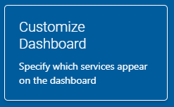

- Click **Show** on the following services if they are not already seen on your screen:

    - Compute Classic
    - Storage Classic
    - Identity Cloud
    - Compute
    - Application Container
    - Autonomous Developer
 
- Your dashboard will look something like this:

  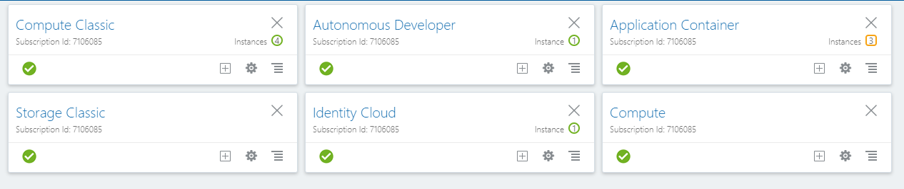

### **STEP 4**: Create a Compartment

Compartments are used to isolate resources within your OCI tenant. User-based access policies can be applied to manage access to compute instances and other resources within a Compartment.

- In the top left corner of the dashboard, click the **hamburger menu**

  

- Click to expand the **Services** submenu, then right-click **Compute** to open in another tab

  

- Click the **hamburger icon** in the upper left corner to open the navigation menu. Under the **Identity** section of the menu, click **Compartments**

  

  

  - Click **Create Compartment**

    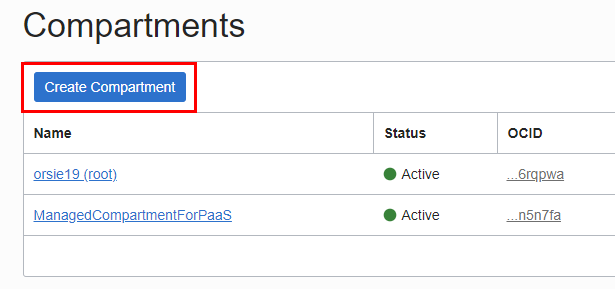

  - In the **Name** field, enter any name you want. For this example we will be using the name `MYSQL` going forward. Enter a **Description** of your choice. Click **Create Compartment**.

    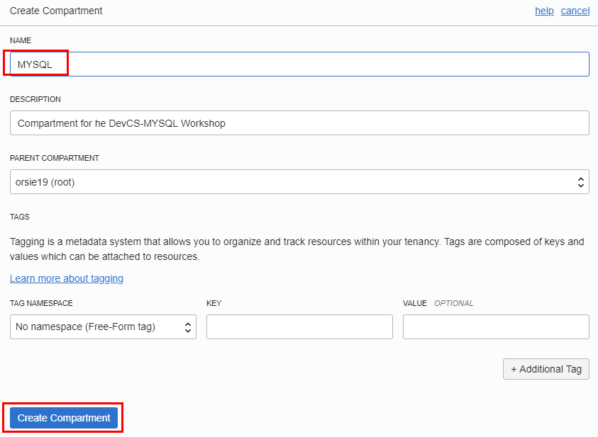

  - In a moment, your new Compartment will show up in the list. We use it next to create components in.

    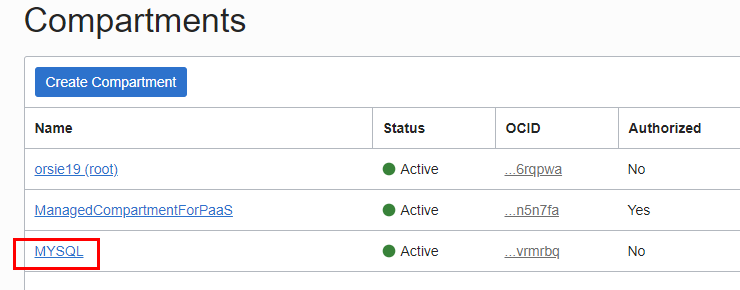

  **NOTE: OCID's are what the Oracle Cloud uses to identify specific components. Here is a description of the key resources we will be using in this workshop:**

    - **IAM:**
Oracle Cloud Infrastructure Identity and Access Management (IAM) lets you control who has access to your cloud resources.

    - **Tenancy:**
The root compartment that contains all of your organization's Oracle Cloud Infrastructure resources. Oracle automatically creates your company's tenancy for you. Directly within the tenancy are your IAM entities (users, groups, compartments, and some policies; you can also put policies into compartments inside the tenancy). You place the other types of cloud resources (e.g., instances, virtual networks, block storage volumes, etc.) inside the compartments that you create.

    - **User:**
An individual employee or system that needs to manage or use your company's Oracle Cloud Infrastructure resources. Users might need to launch instances, manage remote disks, work with your virtual cloud network, etc. End users of your application are not typically IAM users. Users have one or more IAM credentials (see User Credentials).

    - **Compartment:**
A collection of related resources. Compartments are a fundamental component of Oracle Cloud Infrastructure for organizing and isolating your cloud resources. You use them to clearly separate resources for the purposes of measuring usage and billing, access (through the use of policies), and isolation (separating the resources for one project or business unit from another). A common approach is to create a compartment for each major part of your organization. For more information, see Setting Up Your Tenancy.

    - **Home Region:**
The region where your IAM resources reside. All IAM resources are global and available across all regions, but the master set of definitions reside in a single region, the home region. You must make changes to your IAM resources in your home region. The changes will be automatically propagated to all regions. For more information, see Managing Regions. In North America the Region will be Ashburn or Phoenix.

    - **API Public Key Fingerprint:**
    A public key will be supplied to you later in this lab. You will upload that key into your USER so you'll be able to remotely be able to create resources in your Tenancy. Once uploaded a Fingerprint will be generated.

    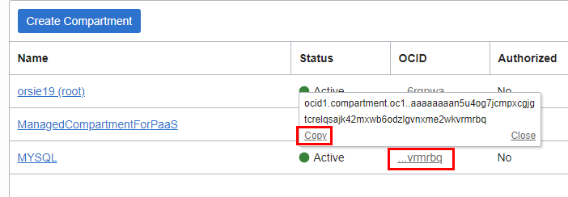

- **Save off the `OCID` of the new compartment** by clicking the **Copy** link. Paste this into a text editor of your choice as we will be referencing this later on in the labs.

- Now, gather other OCID's to be used by clicking the **hamburger icon** in the upper left corner to open the navigation menu. Under the Identity section of the menu, click **Users**.

  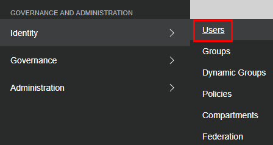

- You see a list of all the users in the account. You can use your login user or the default api.user if it is there. In this example we are using matto. Click the **Copy** link and save that value in your text editor.

  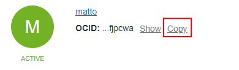

- Scroll to the bottom of the page to **hightlight and (right-click) copy** the Tenacy OCID. Save the value into your text editor.

  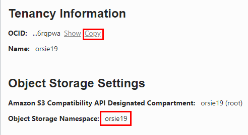

- At the top right of the page you will notice a Region link. The link is not important at this time but the name of the region is. Note what it is and put that into your text editor. In this example it is "us-ashburn-1".

  

### **STEP 5**: Create a Virtual Compute Network

We need a default VCN to define our networking within the `MYSQL` compartment (_Or the name you used for your compartment_). This is where Subnets and Security Lists (access rules) get defined for each Availablity Domain in your Tenancy. Oracle Cloud Infrastructure is hosted in regions and availability domains. A region is a localized geographic area, and an availability domain is one or more data centers located within a region. A region is composed of several availability domains. Availability domains are isolated from each other, fault tolerant, and very unlikely to fail simultaneously. Because availability domains do not share infrastructure such as power or cooling, or the internal availability domain network, a failure at one availability domain is unlikely to impact the availability of the others.

All the availability domains in a region are connected to each other by a low latency, high bandwidth network, which makes it possible for you to provide high-availability connectivity to the Internet and customer premises, and to build replicated systems in multiple availability domains for both high-availability and disaster recovery.

- Click the **hamburger icon** in the upper left corner to open the navigation menu. Under the **Network** section of the menu, click **Virtual Cloud Networks**

    
    
- Select your compartment from the LOV.
    
    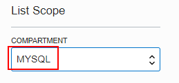

- Click **Create Virtual Cloud Network**

    

- Fill in the follow values as highlighted below:

    **NOTE:** Make sure to **de-select** the `USE DNS HOSTNAMES IN THIS VCN` checkbox)

    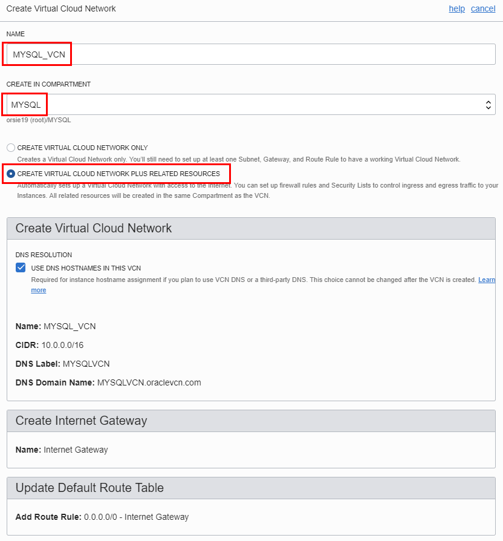

    

- Click **Create Virtual Cloud Network**

- Click **Close** on the details page:

    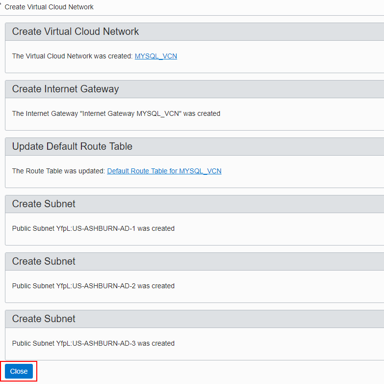

- You will see:

    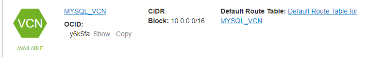

- While we're in this console let's gather one more component OCID that will be used in the lab. Click on the **MYSQL_VCN** link.

  

- You'll notice for redundency reasons that you have a subnet in each of the three Availability Domains in the region. Find the <your- region>-AD-1 subnet and click **Copy**. Save this into your text editor.

  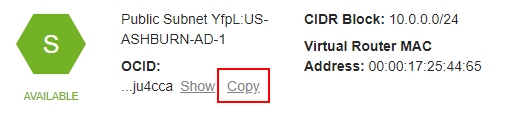

- At this point we have retrieved all the component resources we'll need to remotely work with your account.

### **STEP 6**: Configure Developer Cloud Service Connections

Before you can use Oracle Developer Cloud Service on Oracle Cloud Infrastructure or Oracle Cloud Infrastructure Classic, you must configure connections to Oracle Cloud Infrastructure Compute Classic which controls VM builds AND Storage Classic which stores project artifacts.

- Go back to your services dashboard, click of the Autonomous Developer **hamburger menu**, right-click on **Open Service Console** and select **Open link in new tab**.

  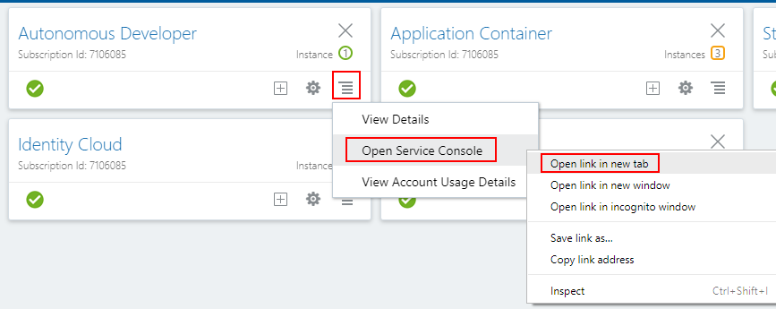

- Click **Create Instance**.

  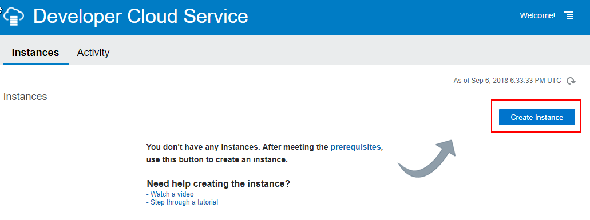

- Enter the following and click **Next** and then click **Create**:

```
Name: MYSQLAlphaOffice
Description: Deployment of Infrastructure and Applications 
```

  

  

- After a few minutes click the **refresh page icon** to see if the status changes from creating service to nothing. You can also expand the **Instance Create and Delete History** to see if you have **green checkmark** that indicates successfull completion.

  

  

- Click on the **MYSQLAlphaOffice** link and then click on the **hamburger menu** on the upper right hand side of the page and select **Access Service Instance**.

  

- You'll see on the page a reminder that links to Compute and Storage needs to take place before any builds and deployments can. Thi was montioned at the beginning of this step.

  

- Right-click on the **Compute** link and select **Open link in new tab**.

  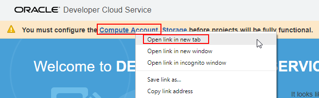

- This takes you into the Organization Configuration (Virtual Machines) page where you'll click the **Configure Compute Account** button.

  

- You'll be asked to supply your **Username**, **Password**, **Service ID** and **REST Endpoint** in the dialog. Enter your login credentials for your Trial Account.

- To obtain the Service ID and REST Endpoint you need to go back to the services dashboard, click on the **Compute Classic hamburger menu** and right-click **View Details** to **Open link in new tab**.

  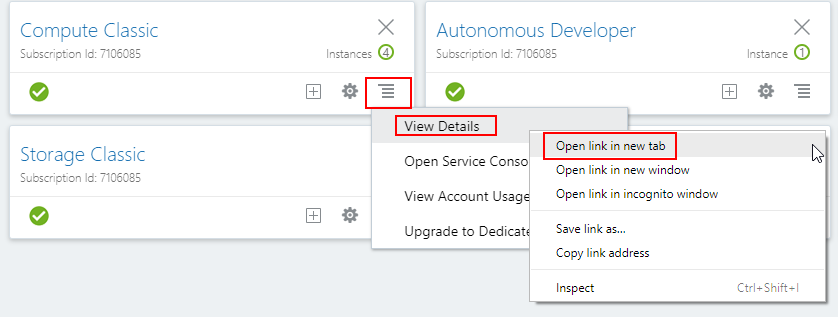

- Copy and paste the two values shown here into their respective fields on the dialog.

  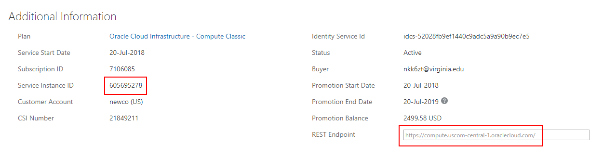

- Also select the **Entering these user credentials...**. Your completed dialog will look something like the example below. Click **Save**. 

  

- You'll breifly see a message saying the credentials have been successfully saved and also see more options pop up on the left hand side of the page. Right-click the **Storage** link and select **Open link in a new tab**.

- Click the **New Configuration** button.

  

- To obtain the required information for creating the connection to the Storage Classic service you need to go back to your main Dashboard, click on the Storage Classic **hamburger menu**, right-click on **View Details** and select **Open link in a new tab**.

  

- In the dialog the

  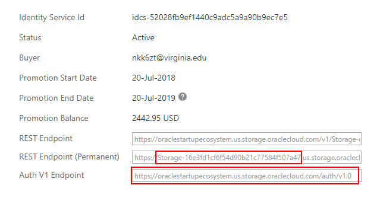


A security list provides a virtual firewall for an instance, with ingress and egress rules that specify the types of traffic allowed in and out. Each security list is enforced at the instance level. However, you configure your security lists at the subnet level, which means that all instances in a given subnet are subject to the same set of rules. The security lists apply to a given instance whether it's talking with another instance in the VCN or a host outside the VCN.

- Click on the **DockerVCN** and then **Security Lists**

    

    

- Click on **Default Security List for DockerVCN**

    

For the purposes of the upcoming Docker deployments we need to add five Ingress Rules that allow access from the Internet to ports 9080, 8002, 18002, 5600, and 8085. In a production environment only the UI port (8085) would typically be opened for access but the labs will have us test various other Application and Oracle centric functionality as we go, thus the need to open other ports.

- Click **Edit All Rules** and then select **+Add Rule**

    

    

- **Enter the following**

**NOTE:** Leave all other values at default

```
Source CIDR: 0.0.0.0/0
Destination Port Range: 8085 
```

- **Add four more Ingress Rules**

```
Source CIDR: 0.0.0.0/0
Destination Port Range: 9080 
```

```
Source CIDR: 0.0.0.0/0
Destination Port Range: 8002 
```

```
Source CIDR: 0.0.0.0/0
Destination Port Range: 18002 
```

```
Source CIDR: 0.0.0.0/0
Destination Port Range: 5600 
```

- When completed your rules should look like:

    

- Click the **Save Security List Rules** button

    

- Your Ingress Rules should look like:

    

### **STEP 6**: Create SSH Key Pair (Linux or Mac client)

Before we create the Compute instance that will contian Docker and application depoyments we need to create an ssh key pair so we'll be able to securly connect to the instance and do the Docker installation, etc.

**NOTE:** `This step focuses on key pair generation for Linux or Mac based terminal sessions. If your going to run your terminal sessions from a Windows client then skip to STEP 7`

- In a `Linux/Mac` client terminal window **Type** the following (**You don't have to worry about any passphrases unless you want to enter one**)

```
ssh-keygen -b 2048 -t rsa -f dockerkey
```

- Your key pair is now in the current directory

    
    
- **NOTE for Linux and Mac Clients:** Just open up the pubic key file in an editor (vi) and select / copy the entire contents to be used in Step 8.   

    

### **STEP 7**: Create SSH Key Pair (Windows client)

For Windows clients this example will show the use of PuttyGen to generate the keypair. [Putty and PuttyGen](https://www.chiark.greenend.org.uk/~sgtatham/putty/latest.html) are available for download.

- Run **PuttyGen** and click **Generate**

    

- Once the generation process completes click the **Save Private Key** button and save to a directory of your choice.

- If prompted to save without a passphrase click yes. 

    

**NOTE:** `Do not save the public key as the format is not compatable with Linux openSSH.

- Instead, **Select the entire Public Key in the display and right-click copy**. `This content will be pasted into the Create Instance dialog in Step 8.`

    

### **STEP 8**: Create a Compute Instance

You will now create a Linux based Compute instance using the public key you just generated.

- Go back to your OCI console and from the hamburger menu in the upper left hand corner select **Compute-->Instances**

    

-Click **Create Instance**

   

- **Select or Type** the following in the `Instance` section of the dialog:

```
Name: Docker
Availability Domain: xxx-AD-1
Boot Volume: Oracle-Provided OS Image
Image Operating System: Oracle Linux 7.5
Shape Type: Virtual Machine
Shape: VM.Standard2.1
SSH Keys: Choose SSH Key Files
```

- You will Browse and select your PUBLIC SSH Key
**NOTE:** You will paste the public key you copied in Step 7 into the SSH KEY field by selecting the "Paste SSH Keys" radio button. `The public key should all be on ONE LINE` 

   

- In the Network Section **Select** the following:

```
Virtual Cloud Network: DockerVCN
```

   

- Click **Create Instance**

After a few minutes you should see a running instance with a Public IP Address.

- `Make a note of the IP Address as we will be using this in the next step.`

   


### **STEP 9**: SSH into the Instance and install Docker

The last set up piece will be to SSH into the Compute image and install Docker and GIT.

- For a Windows client session bring up Putty, select the **Session** section and type in the IP address:

   

- Select the **Data** section and enter the following as the username:

```
opc
```

- Screenshot:

  

- Select **SSH-->Auth** and browse to the Private Key you created back in Step 7:

    

- Click the **Open** button. You will presented the first time with am alert message. Click **Yes**

   

- You will logged into the Compute image:

   

- **NOTE:** For Linux and Mac client sessions "cd" into the directory where your key pair is. Make sure the dockerkey file has the permissions of "600" (chmod 600 dockerkey) and ssh into the compute instance `substituting your IP address`.

Example:

```
cd <directory of your key pair>
chmod 600 dockerkey
ssh -i ./dockerkey opc@129.213.119.105
```

- Linux / Mac screenshot:

  

### **STEP 10**: Install and configure Docker and GIT

Docker and GIT are required for the subsuquent labs. You will install the Docker engine, enable it to start on re-boot, grant docker privledges to the `opc` user and finally install GIT.

- **Type** the following:

```
sudo -s
yum install docker-engine
usermod -aG docker opc
systemctl enable docker
systemctl start docker
```

- **NOTE:** During the `yum install docker-engine` command press `Y` is asked if installation is ok.

- Screenshot at the end of the Docker installation:

   

   

- **Type** the following:

```
yum install git
```

- Screenshot at the end of the GIT installation:

   

- **Type** the following to verify good installations:

```
su - opc
docker version
docker images
git --version
```

   

### **STEP 11**: Edit /etc/sysconfig/selinux

Set the server to Permissive mode and also ensure that permissive mode survives re-boots by editing `/etc/sysconfig/selinux`

- Using vi, change the SELINUX line to **permissive**. **Type** the following: (**NOTE**: You need to be the root user to edit this file)

```
sudo -s
vi /etc/sysconfig/selinux
```

- **NOTE:** If new to vi, press the letter `i` to edit text. To save press Escape, the type `:wq!`.

   

- Save the file and exit out of vi

- Now, **Type** the following:

```
setenforce 0
sestatus
```

- Verify that your server is in permissive mode.

   

- **Type** the following to exit out of `root` and go back and verify that you're now the `opc` user:

```
exit
whoami
```

   

- You are ready to proceed to Lab 100

**This completes the Set Up!**
