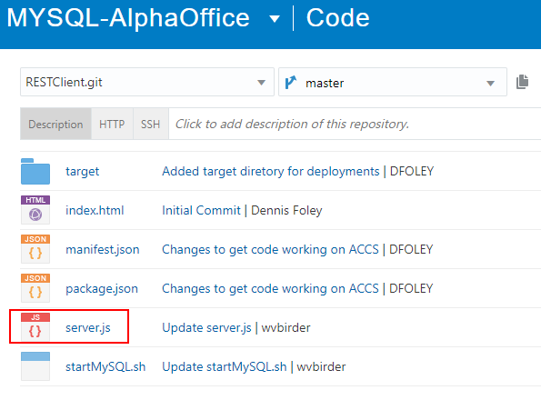

# MYSQL Deployment using Infrastructure as Code

 

## Introduction
In this lab we introductive basic concepts of container deployed Microservices.  We will do this using Developer Cloud Service builds and deployments to the Application Container Cloud Service located in your Trial Account. Two microservices will be deployed. They are both Node.js applications. The REST client application communicates to a backend datasource, which in our case is the MYSQL database running as a Compute instance created in Lab 100. The second deployment is the AlphaOffice UI Node.js application which takes data from the `REST Client` application and displays the results to an end user in a browser.

***To log issues***, click here to go to the [github oracle](https://github.com/oracle/learning-library/issues/new) repository issue submission form.

## Objectives

- Build, Deploy and test a Microservices application (AlphaOffice)

## REST Client Build

### **STEP 1**: Open up a Terminal Window

- In your Developer project click on the **Project** link and in the Repositories section click **New Repository**.


- In the dialog box enter:

```
RESTClient
```

- Select the **Import exsiting repository** radio button and enter OR **Cut and Paste**:

```
https://github.com/wvbirder/AlphaOfficeMYSQL-REST.git
```

  

- Click **Create**

- The `RESTClient` application files are imported.

  

- Click on the project **Build** link and select **New Job**.

  

-  Enter the following for Job Name:

```
AlphaOffice-RESTClient
```

- Select the **PackerTerraformNodeJS** Software Template and click **Create Job**.

  

- In the **Source Control** tab select **Add Source Control-->Git**.

  

- In the Git dialog select the **RESTClient.git** repository and check the **Automatically perform build based on SCM commit** checkbox. This means any change changes to the files within the repository will fire off a new build.

  

- Select the **Builders** tab and in the Add Builder drop down choose **Unix Shell Builder**.

  

- Enter the following Script command:

```
npm install
```

  

- Select the **Post Build** tab and from the Add Post Build Action choose **Artifact Archiver**. 


  

- In the Files to Archive field enter:

```
**/target/*
```
  

- Click the **Save** button.

- Click the **Build Now** button. The job is queue for execution.

  

  

  - The build should complete within a few minutes time. Clicking on the **Build Log** icon will show a bundled .zip file created.

  

  

  

- Now create a Deployment job. Click the project **Deploy** link and select **New Configuration**.

   

  

- Enter the following:

```
Configuration Name: AlphaOffice-RESTClient-Deploy
Application Name: AlphaOfficeREST
```

- then, select from the Deployment Target field, **New-->Application Container Cloud**.

  

- The Application Container Cloud dialog requires an Identity Domain entry. To obtain this entry go to the main Dashboard and click on the Identity Cloud Service **hamburger menu**, right-click on **View Details* and select **Open link in new tab**.  

  

- The Service ID we need is in the Additional Information section. Cut and Paste the **Identity Service ID** and put into the Developer Deployment dialog Identity Domain field.

  

- Finish off the dialog by selecting 

    - Datacenter: **us1** OR **us2**

... and entering your Trial Account **Username** and **Password**. Click the **Test Connection** button.

  

- The connection should be successfull. Click **Use Connection**.

  

- Finish off the New Connection dialog by setting the following properties:

    - **Runtime**: NODE
    - **Subscription**: Hourly
    - **Type**: Automatic (Stable builds only)
    - **Job**: AlphaOffice-RESTClient
    - **Artifact**: target/mysqlmicroservice.zip
    - **Include ACCS Deployment**:

    ```
    {
    "memory": "1G",
    "instances": "1"
    }
    ```
- Click **Save**.

  

  

  

  


### **STEP 2**: Verify that Docker is running

**NOTE: For the duration of the Labs it's OK that the login user (holuser vs. opc) and the Docker version may vary from the screenshots**

- **Type** the following:

```
 cd
 docker version
```

The information on your docker engine should be displayed:


**This completes the Lab, you can continue to Lab 200**
