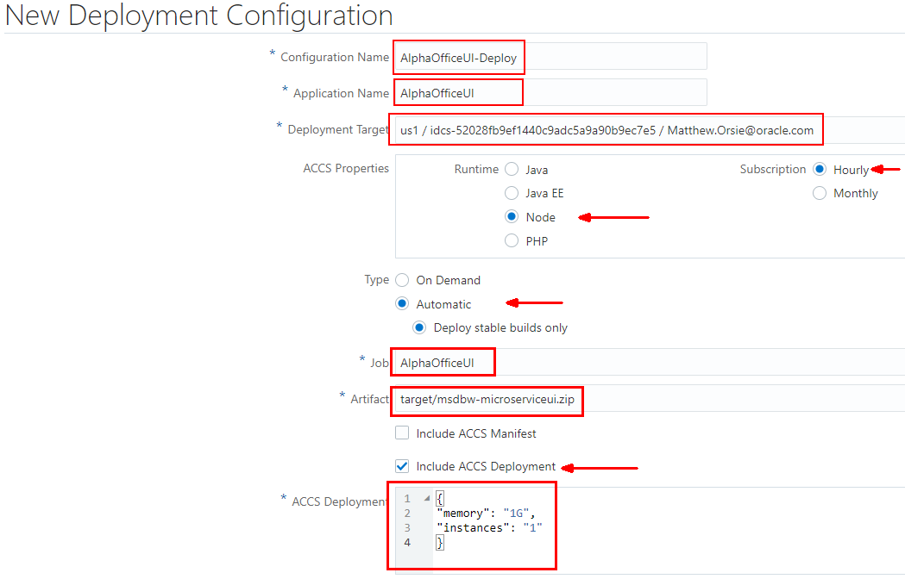
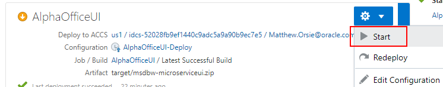

# MYSQL Deployment using Infrastructure as Code

 

## Introduction

In this lab we introduce basic concepts of container deployed Microservices.  We will do this using Developer Cloud Service builds and deployments to the Application Container Cloud Service located in your Trial Account. Two microservices will be deployed. They are both Node.js applications. The RESTClient Node.js application communicates to a backend datasource, which in our case is the MYSQL database running as a Compute instance created in Lab 100. The second deployment is the `AlphaOffice UI` Node.js application which takes data from the `RESTClient` application.

***To log issues***, click here to go to the [github oracle](https://github.com/oracle/learning-library/issues/new) repository issue submission form.

## Objectives

- Build, Deploy and test a Microservices application (AlphaOffice)

### **STEP 1**: RESTClient Build and Deployment

- In Developer click on the **Project** link and in the Repositories section click **New Repository**.


- In the dialog box enter:

```
RESTClient
```

- Select the **Import exsiting repository** radio button and enter OR **Cut and Paste**:

```
https://github.com/wvbirder/AlphaOfficeMYSQL-REST.git
```

  

- Click **Create**

- The `RESTClient` application files are imported.

  

- Click on the **server.js** file and then click on the **pencil icon** to edit. In the host section of the connection variable replace **host     : 'YOUR-IPADDR-HERE',** with the Public IP Address you obtained from the MYSQL Compute Instance.

Example:

**This**:     host     : 'YOUR-IPADDR-HERE',

**Becomes**:      host     : '129.213.137.223',

  

- Click the **Commit** button on the edit page and the pop up dialog.

- Click on the project **Build** link and select **New Job**.

  

-  Enter the following for Job Name:

```
AlphaOffice-RESTClient
```

- Select the **PackerTerraformNodeJS** Software Template and click **Create Job**.

  

- In the **Source Control** tab select **Add Source Control-->Git**.

  

- In the Git dialog select the **RESTClient.git** repository and check the **Automatically perform build based on SCM commit** checkbox. This means any changes to the files within the repository will fire off a new build.

  

- Select the **Builders** tab and in the Add Builder drop down choose **Unix Shell Builder**.

  

- Enter the following Script command:

```
npm install
```

  

- Select the **Post Build** tab and from the Add Post Build Action choose **Artifact Archiver**. 


  

- In the Files to Archive field enter:

```
**/target/*
```
  

- Click the **Save** button.

- Click the **Build Now** button. The job is queue for execution.

  

  

  - The build should complete within a few minutes time. Clicking on the **Build Log** icon will show a bundled up .zip file was created.

  

  

  

- Now create a Deployment job. Click the project **Deploy** link and select **New Configuration**.

   

  

- Enter the following:

```
Configuration Name: AlphaOffice-RESTClient-Deploy
Application Name: AlphaOfficeREST
```

- Then select from the Deployment Target field, **New-->Application Container Cloud**.

  

- The Application Container Cloud dialog requires an Identity Domain entry. To obtain this entry go to the main Dashboard and click on the Identity Cloud Service **hamburger menu**, right-click on **View Details** and select **Open link in new tab**.  

  

- The Service ID we need is in the Additional Information section. Cut and Paste the **Identity Service Id** and put it into the Developer Deployment dialog `Identity Domain` field.

  

- Finish off the dialog by selecting 

    - Datacenter: **us1** OR **us2**

... and enter your Trial Account **Username** and **Password**. Click the **Test Connection** button.

  

- It may take a minute or so the first time but the connection should be successfull. Click **Use Connection**.

  

- Finish off the New Connection dialog by setting the following properties:

    - **Runtime**: NODE
    - **Subscription**: Hourly
    - **Type**: Automatic (Stable builds only)
    - **Job**: AlphaOffice-RESTClient
    - **Artifact**: target/msdbw-mysqlmicroservice.zip
    - **Include ACCS Deployment**:

- The folowing text block goes into ACCS Deployment:

    ```
    {
    "memory": "1G",
    "instances": "1"
    }
    ```
- Click **Save**.

  

- The `AlphaOfficeREST` deployment will be displayed. Select **Start** from the drop down actions menu. If prompted, click **Deploy**.

  

**NOTE:** The build field stipulates which build to use for the deployment.

- **The deployment connects to the Application Container Cloud Service in your Trial Account and deploys the application into a container** (Docker in this case). It may be several minutes before it is completed.

- Example screen shot of a Redeploy


- **NOTE: If you get an error on the first Start or Deployment do a Redeploy**.

  

  

- The action menu can also Stop or Start a container:

  

- You can check the deployment inside the Application Container Cloud Service Console by going to the main Dashboard and clicking on the Application Container **hamburger menu**, right-clicking on **Open Service Console** and selecting **Open link in new tab**.
  
  

  

- Back in the Developer's **Deploy** screen right-click on the `AlphaOfficeREST` deployment and select **Open link in new tab**. It will show the RESTClient application.

  

  

- Add the following suffix to the application URL:

```
/products
```

- If your browser has a JSON formatting add-on you'll see data returned from the MYSQL database in JSON format, else you'll see a large text string. In ether case your RESTClient is connected to the MYSQL AlphaOffice schema and querying data.

  

- Now change the the URL to query one product. Change the URL to:

```
/product/1025
```

 **NOTE:** (Product is singular in this case)

- You should see:

  

### **STEP 2**: AlphaOffice UI Build and Deployment

In this step you will build and deploy the AlphaOffice UI Node.js application. It follows the same steps as we did in Step 1.

- Click on the **Project** link and in the Repositories section click **New Repository**.


- In the dialog box enter:

```
AlphaOfficeUI
```

- Select the **Import exsiting repository** radio button and enter OR **Cut and Paste**:

```
https://github.com/wvbirder/ProductCatalogUI.git
```

  

- Click **Create**

- The `AlphaOfficeUI` application files are imported.

  

- **Navigate to public-->js**. Click on the **AlphaOffice.js** file. You are going to change the **dbServiceURL** variable and replace the **localhost:8002** portion of the string with the URL of the newly deployed `RESTClient` Application. To obtain that URL click on the project **Deploy** link and right-click on the **AlphaOfficeREST** link and select **Copy link address**. 

  

- Once copied go back to the Code `AlphaOfficeUI.git` repository and replace the current string with the copied URL. **Navigate to public-->js**. Click on the **AlphaOffice.js** file and then click on the **pencil icon** to edit. You can use CTRL-V to paste the string into the file.

Example:

**This**: "http://localhost:8002/products";

**Becomes**: "https://alphaofficerest-oraclestartupecosystem.uscom-central-1.oraclecloud.com/products";

**NOTE: Remember to keep the `/products` portion of the URL.**

  

- Click the **Commit** button on the edit page and in the pop up dialog.

- Click on the project **Build** link and select **New Job**.

  

-  Enter the following for Job Name:

```
AlphaOfficeUI
```

- Select the **PackerTerraformNodeJS** Software Template and click **Create Job**.

  

- In the **Source Control** tab select **Add Source Control-->Git**.

  

- In the Git dialog select the **AlphaOfficeUI.git** repository and check the **Automatically perform build based on SCM commit** checkbox. This means any change changes to the files within the repository will fire off a new build.

  

- Select the **Builders** tab and in the Add Builder drop down choose **Unix Shell Builder**.

  

- Enter the following Script command:

```
npm install
```

  

- Select the **Post Build** tab and from the Add Post Build Action choose **Artifact Archiver**. 


  

- In the Files to Archive field enter:

```
**/target/*
```
  

- Click the **Save** button.

- Click the **Build Now** button. The job is queue for execution.

  

  

  - The build should complete within a few minutes time. Clicking on the **Build Log** icon will show a bundled .zip file.

  

  

  

- Now create a Deployment job. Click the project **Deploy** link and select **New Configuration**.

   

  

- Enter the following:

```
Configuration Name: AlphaOfficeUI-Deploy
Application Name: AlphaOfficeUI
```

- Then in the Deployment Target field **re-use** the target connection you created in the RESTClient deployment.

  

- Finish off the dialog by entering your Trial Account **Username** and **Password**. Click the **Test Connection** button.

  

- The connection should be successfull. Click **Use Connection**.

  

- Finish off the New Connection dialog by setting the following properties:

    - **Runtime**: NODE
    - **Subscription**: Hourly
    - **Type**: Automatic (Stable builds only)
    - **Job**: AlphaOfficeUI
    - **Artifact**: target/msdbw-microserviceui.zip
    - **Include ACCS Deployment**:


- The folowing text block goes into ACCS Deployment:

    ```
    {
    "memory": "1G",
    "instances": "1"
    }
    ```
- Click **Save**.

  

- The `AlphaOfficeUI` deployment will be displayed. Select **Start** from the drop down actions menu. If prompted, click **Deploy**.

  

**NOTE:** The build field stipulates which build to use for the deployment.

- **The deployment connects to the Application Container Cloud Service in your Trial Account and attempts to deploy the application into a container** (Docker in this case). It may be several minutes before it is completed.

- Example screen shot of a Redeploy


- **NOTE: If you get an error on the first Start or Deployment do a Redeploy**. (example shown)

  

  

- Deployment should be successful:

  

- You can check the deployment inside the Application Container Cloud Service Console by going to the main Dashboard and clicking on the Application Container **hamburger menu**, right-clicking on **Open Service Console** and selecting **Open link in new tab**.
  
  

  

- Back in the Developer project Deploy screen right-click on the `AlphaOfficeUI` deployment and select **Open link in new tab**. It should show the AlphaOffice application displaying the Product Catalog obtained from the MYSQL database.

  

  

**This completes the Lab, you can continue to Lab 300**
