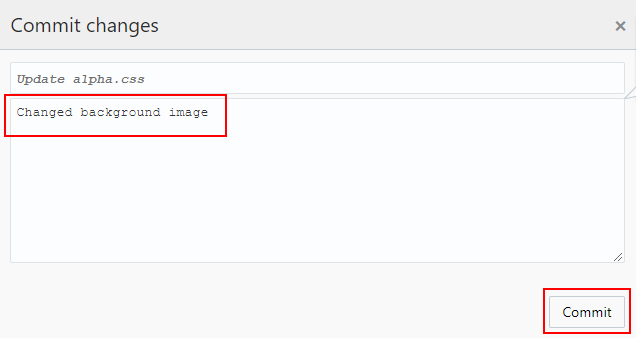

# MYSQL Deployment using Infrastructure as Code

  
Updated: June 22, 2018

## Introduction

The Agile methodology of software development is a type of incremental model that focuses on process adaptability and customer satisfaction. In Oracle Developer Cloud Service, you can use the Agile methodology to manage issues using Scrum and Kanban boards. Although we will not be creating an Agile board and Issues in this lab Developer Cloud Service fully supports team development.

This lab will focus on a developer persona (Serena) having to make a couple of changes to the AlphaOfficeUI. One is a bug fix and the others are cosmetic. 

***To log issues***, click here to go to the [github oracle](https://github.com/oracle/learning-library/issues/new) repository issue submission form.

## Objectives

- Fix the Browser tab type in the AlphaOffice UI
- Change the background color of the UI
- Test the changes

## Make Changes to the AlphaOfficeUI

Modifications will be made to the current UI code and a new Build and Redeploy will be fired off.

### **STEP 1**: Fix a Bug

- There is a typo in the browser tab. You'll notice that it says "Aplha Office Product Listing". Click on the project **Code** link 

  

- In the `AlphaOfficeUI.git` repository Click on the **alpha.html** file.

  

- Click on the pencil icon to edit.

  

- Change the text for the browser tab title to:

```
Alpha Office Product Listing
```
  

- You can also change the title of the main page to whatever you would like:

Example:

```
<Your-name> Office Supply
```

  

- Click the **Commit** button

  

- In the commit dialog enter:

```
Fixed the Browser tab typo
```

- ... and click **Commit**.

  

- The commit will fire off a new Build and Redeploy of `AlphaOfficeUI`. You can monitor the progress of both by going to the Build and Deploy links respectively. It will take a few minutes before the build is completed.

- Clicking on the project **Build** link you will see the build job queued and then completed.

  

  

    

- After a few more minutes click the project **Deploy** link and then select the `AlphaOfficeUI` deploy sub-section **arrow** to display the latest actions that have occurred. The latest deployment should show using the latest build.

**NOTE:** If you don't see the deployment updated you can refresh the browser page.

  

- Refresh the browser **Alpha Office Product Listing** tab to see the changes.

  

  

### **STEP 2**: Change the UI background color

- Click the project **Code** link and in the `AlphaOfficeUI.git` repository go to the **public-->css** directory. Click on the **Alpha.css** file.

  

- Click on the pencil icon to edit.

   

- Edit the `alpha.css` background url image reference to say:

```
dark_blue.jpg
```

  

- Click the **Commit** button and in the dialog enter the following in the description field:

```
Changed background image
```

  

- Click **Commit**.

- As in the Step 1 a new Build and Deployment will take place after serval minutes. Check the deployment progress by going to the project Deploy link and refreshing the browser page. Wait until it shows the deployment completed based on the latest build.

  

- In the browser refresh the **Alpha Office Product Listing** tab to confirm the changes.

   

**This completes the Lab and the Workshop**
